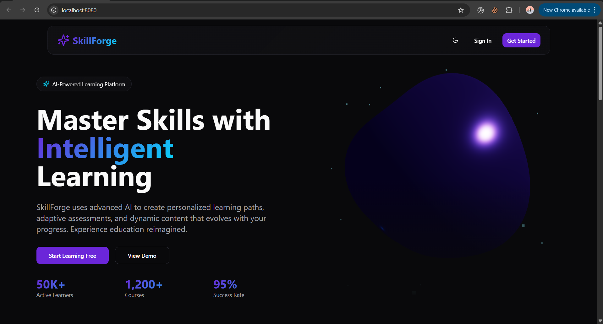
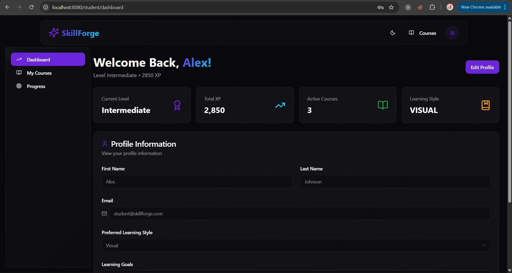
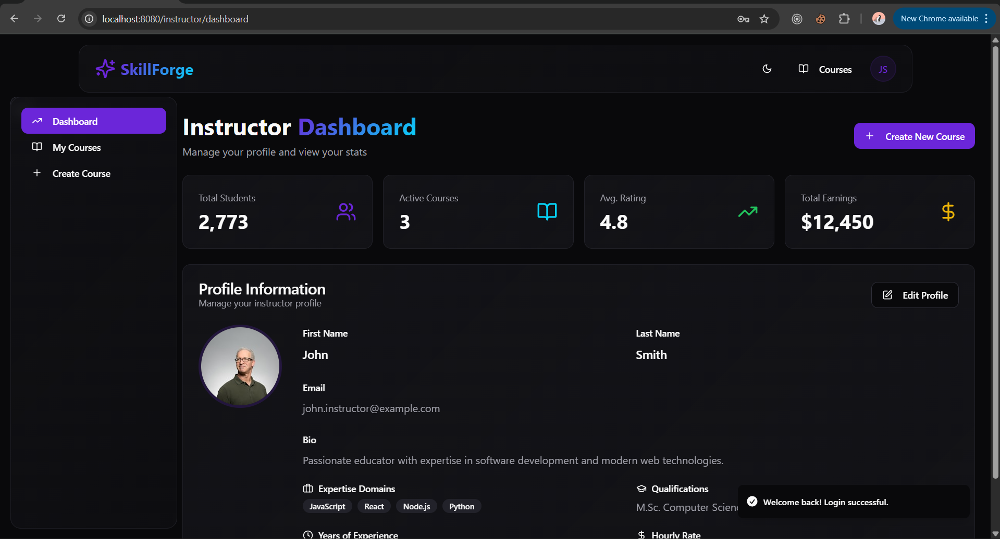
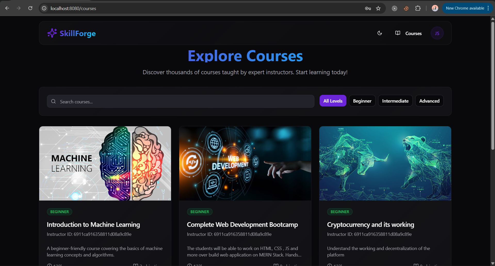
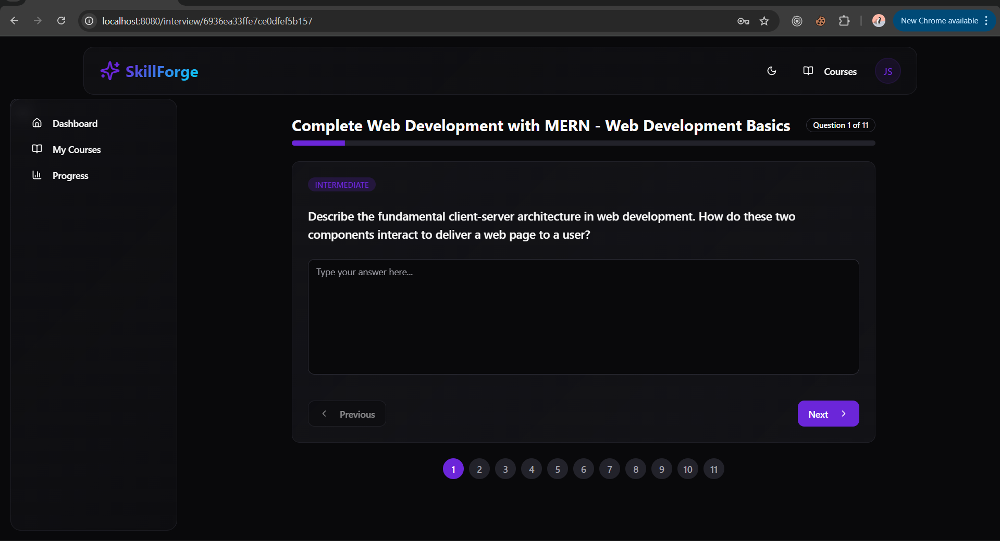

# 🎓 SkillForge E-Learning Platform


**SkillForge** is a comprehensive Learning Management System (LMS) developed as a collaborative project. It bridges the gap between traditional online learning and AI-driven assessment. Our platform empowers instructors to craft detailed courses and enables students to validate their skills through **Generative AI interviews**.

This project demonstrates a full-stack micro-learning architecture using **React (Vite)**, **Spring Boot**, and **MongoDB**, featuring secure **AWS S3** integration for media streaming.

---

## 👥 Meet the Team

This project was built by a team of 4 developers, each contributing to different aspects of the full-stack architecture.

| Name  | GitHub |
| :---  | :--- |
| **Jasjeev**  | [@jasjeev013](https://github.com/jasjeev013) |
| **Rakesh Mahapatra** |  [@rakesh0z](https://github.com/rakesh0z) |
| **Karimulla Sayyad** | [@Karimulla397](https://github.com/Karimulla397) |
| **Aadi Dayal** |  [@Aadidayal](https://github.com/Aadidayal) |

---

## 🚀 Key Features

### 🧠 AI-Powered Assessment
* **AI Subjective Interviews:** Unlike standard quizzes, our system conducts a written AI interview after course completion to evaluate deep conceptual understanding.
* **Auto-Generated Quizzes:** Instructors can use AI to parse course content and generate questions automatically.

### 👨‍🏫 Instructor Portal
* **Course Builder:** Intuitive drag-and-drop interface for organizing Sections, Topics, and Material.
* **Media Management:** Secure video and PDF uploads handled via AWS S3.
* **Analytics:** Track student enrollment and course performance.

### 👨‍🎓 Student Experience
* **Immersive Learning:** A distraction-free, 3D-enhanced UI (using Three.js) for engaging study sessions.
* **Progress Tracking:** Visual graphs for quiz scores and course completion percentages.
* **Certification:** Automated certificate generation upon passing the final AI interview.

### 🔐 Enterprise-Grade Security
* **Role-Based Access Control (RBAC):** Distinct permissions for Admins, Instructors, and Students.
* **Stateless Authentication:** JWT (JSON Web Token) security with custom filters.
* **Data Validation:** Strict payload validation using Zod (Frontend) and Jakarta Validation (Backend).

---

## 🛠 Tech Stack

| Domain | Technologies |
| :--- | :--- |
| **Frontend** | React 18, TypeScript, Vite, Tailwind CSS, Shadcn/UI, Three.js, React Query |
| **Backend** | Spring Boot 3.5.7, Java 21, Spring Security, Spring Data MongoDB |
| **Database** | MongoDB (Document Store) |
| **Cloud/AI** | AWS S3 (Storage), OpenApi (AI Integration) |
| **DevOps** | Maven, Eslint, Docker (Optional) |

---

## 📂 System Architecture

```text
jasjeev013-skillforge-e-learning-platform/
├── client/                 # React SPA
│   ├── src/components/     # UI & 3D Components
│   ├── src/pages/          # Route Views
│   └── src/services/       # API Connectors
└── server/                 # Spring Boot API
    ├── config/             # Security & AWS Config
    ├── controllers/        # REST Endpoints
    ├── services/           # Business Logic
    └── models/             # Database Schemas
````

-----

## ⚙️ Local Development Setup

### Prerequisites

  * Node.js (v18+) & npm
  * Java JDK 21
  * MongoDB running locally on port `27017`

### 1\. Backend Configuration

1.  Navigate to `server/`.
2.  Update `src/main/resources/application.properties` with your credentials:
    ```properties
    spring.data.mongodb.uri=mongodb://localhost:27017/skillforge
    jwt.secret=YOUR_SECURE_SECRET
    cloud.aws.credentials.access-key=YOUR_AWS_KEY
    cloud.aws.credentials.secret-key=YOUR_AWS_SECRET
    ```
3.  Run the server:
    ```bash
    ./mvnw spring-boot:run
    ```

### 2\. Frontend Configuration

1.  Navigate to `client/`.
2.  Install dependencies:
    ```bash
    npm install
    ```
3.  Run the development server:
    ```bash
    npm run dev
    ```

-----

## 📸Project Screenshots

| Landing Page | Student Dashboard |
|:---:|:---:|
|  |  |

| Instructor Dashboard | Admin Dashboard |
|:---:|:---:|
|  |  |

| Course Interface | AI Interview |
|:---:|:---:|
|  |  |

-----

## 🤝 Contributing

This is a group project, but open-source contributions are welcome.

1.  Fork the Project
2.  Create your Feature Branch (`git checkout -b feature/AmazingFeature`)
3.  Commit your Changes (`git commit -m 'Add some AmazingFeature'`)
4.  Push to the Branch (`git push origin feature/AmazingFeature`)
5.  Open a Pull Request
